# ClawStarter — Codebase Map

## Overview

ClawStarter is a production-grade setup automation toolkit for OpenClaw (personal AI assistant framework). It packages battle-tested production workflows into a beginner-friendly installer with an interactive companion webpage. Built with bash 3.2 (macOS default), HTML/CSS/JS (no dependencies), and Markdown documentation.


## Directory Structure

```
clawstarter/
├── companion.html                      # Interactive setup walkthrough
├── index.html                          # Marketing landing page
├── openclaw-quickstart-v2.sh          # Primary installer (v2.7.0-prism-fixed)
├── openclaw-autosetup.sh              # 19-step automated setup
├── openclaw-verify.sh                 # 18-check diagnostic
├── CLAUDE.md                          # Agent reference (you are here)
├── README.md                          # User-facing overview
├── ROADMAP.md                         # Development roadmap
├── SECURITY.md                        # Security policy
├── CONTRIBUTING.md                    # Contributor guidelines
├── LICENSE                            # MIT License
├── docs/                              # Documentation
│   ├── CODEBASE_MAP.md               # This file
│   ├── subagent-1-core.md            # Core scripts analysis
│   ├── subagent-2-templates.md       # Templates analysis
│   ├── subagent-3-reviews.md         # PRISM review index
│   └── subagent-4-fixes-research.md  # Security & research
├── templates/                         # Workspace templates
│   └── workspace/                     # 8 core templates
│       ├── AGENTS.md                 # Operating manual
│       ├── SOUL.md                   # Personality
│       ├── IDENTITY.md               # Name/emoji/vibe
│       ├── USER.md                   # Owner profile
│       ├── MEMORY.md                 # Long-term memory
│       ├── HEARTBEAT.md              # Daily rhythm
│       ├── BOOTSTRAP.md              # First-run wizard (self-deletes)
│       └── TOOLS.md                  # Infrastructure notes
├── starter-pack/                      # Beginner-friendly configs
│   ├── STARTER-PACK-MANIFEST.md      # Complete guide
│   ├── AGENTS-STARTER.md             # Simplified operating manual
│   ├── SOUL-STARTER.md               # Personality template
│   ├── CRON-TEMPLATES.md             # 5 pre-configured jobs
│   ├── SECURITY-AUDIT-PROMPT.md      # Self-audit checklist
│   └── SKILLS-STARTER-PACK.md        # Skill installation guide
├── workflows/                         # Domain-specific bundles
│   ├── content-creator/              # Social, video, podcasts
│   ├── app-builder/                  # Coding, GitHub, dev tools
│   └── workflow-optimizer/           # Email, calendar, tasks
├── fixes/                             # Security patches
│   ├── phase1-1-api-key-security.sh
│   ├── phase1-2-injection-prevention.sh
│   ├── phase1-3-race-condition.sh
│   ├── phase1-4-template-checksums.sh
│   ├── phase1-5-plist-injection.sh
│   ├── stdin-tty-fix.patch
│   ├── re-enable-checksums.sh
│   └── critical-fixes-tests.sh       # 52+ test cases
└── reviews/                           # PRISM marathon output
    ├── prism-01-security-audit.md    # Security findings
    ├── prism-01-ux-flow.md           # UX analysis
    ├── prism-05-positioning.md       # Business strategy
    ├── prism-07-go-to-market.md      # GTM plan
    └── PRISM-MARATHON-EXECUTIVE-SUMMARY.md
```

## Module Guide

### Root Scripts

**openclaw-quickstart-v2.sh** — Primary installer
- **Version:** 2.7.0-prism-fixed
- **Size:** 19,470 tokens
- **Purpose:** Security-hardened automated installation (3 questions, 15-20 minutes)

| Function | Purpose | Key exports |
|----------|---------|-------------|
| `step1_install()` | Homebrew + Node.js + OpenClaw installation | None (modifies system) |
| `step2_configure()` | 3-question wizard (API key, use case, setup type) | Determines model/personality/security |
| `step3_setup()` | Config generation, workspace scaffolding, LaunchAgent | Creates openclaw.json + plist |
| `keychain_store()` | macOS Keychain integration | Stores API keys securely |
| `validate_api_key()` | Format validation (sk-or-*, sk-ant-*) | Blocks invalid keys |
| `verify_and_download_template()` | Template download + checksum verification | Downloads from GitHub |
| `guided_api_signup()` | Interactive API key acquisition | Guides users through signup |

**openclaw-autosetup.sh** — Full automation (19 steps)
- **Size:** 22,570 tokens
- **Purpose:** Comprehensive setup with progress tracking and resume capability

| Function | Purpose | Key exports |
|----------|---------|-------------|
| `atomic_config_edit()` | Atomic JSON config editing with rollback | Safe config updates |
| `mark_step()` | Progress tracking to JSON file | Enables --resume |
| `is_step_done()` | Check step completion status | Skip completed steps |
| `pause_for_human()` | Human checkpoint for manual steps | Waits for user action |

**openclaw-verify.sh** — Post-install diagnostic (18 checks)
- **Size:** 7,787 tokens
- **Purpose:** Comprehensive verification with color-coded output

| Check | Validates | Fix instructions |
|-------|-----------|------------------|
| Node.js version | v22+ requirement | Upgrade via Homebrew |
| OpenClaw version | Min 2026.1.29, recommend 2026.2.9+ | Update via curl |
| Gateway status | LaunchAgent loaded, port 18789 open | Restart gateway |
| Config validity | JSON structure, permissions, API keys | Regenerate config |
| Security | FileVault, exposed keys, TCC permissions | Enable encryption, move keys |

### Web Pages

**companion.html** — Interactive setup walkthrough
- **Size:** 18,872 tokens
- **Purpose:** Step-by-step guide synchronized with Terminal output

| Section | Purpose | Interactive elements |
|---------|---------|---------------------|
| Before You Start | Pre-install checklist | Checkboxes (localStorage) |
| Steps 1-4 | Download + Terminal launch | Copy buttons |
| Steps 5-10 | Terminal walkthrough | Accordions matching script output |
| Now What? | Post-install actions | Links to dashboard/Discord |

**index.html** — Marketing landing page
- **Size:** 13,875 tokens
- **Purpose:** Video hero, feature highlights, installation quick-start

| Section | Purpose | Interactive elements |
|---------|---------|---------------------|
| Hero | Main value prop + CTA | Video player, copy command |
| Installation | One-command install | Click-to-copy pre block |
| Features | 6 feature cards | Hover effects |
| FAQ | 8 common questions | Accordion |

### Starter Pack

**Purpose:** Pre-configured production-tested foundation for beginners (45KB total)

| File | Size | Purpose |
|------|------|---------|
| STARTER-PACK-MANIFEST.md | 12KB | Complete installation guide, operating costs, learning path |
| AGENTS-STARTER.md | 7KB | Simplified operating manual (from 24KB production version) |
| SOUL-STARTER.md | 4KB | Personality template |
| CRON-TEMPLATES.md | 12KB | 5 pre-configured jobs (~$0.37/month overhead) |
| SECURITY-AUDIT-PROMPT.md | 10KB | Self-service security checklist |

### Workspace Templates

**Purpose:** Universal base files for any OpenClaw agent

| Template | Size | Purpose | Personalized by |
|----------|------|---------|----------------|
| AGENTS.md | 24KB | Complete operating manual | User (manual) |
| SOUL.md | Variable | Personality framework | BOOTSTRAP.md |
| IDENTITY.md | <1KB | Agent self-concept (name/emoji/vibe) | BOOTSTRAP.md |
| USER.md | Variable | Owner profile | BOOTSTRAP.md |
| MEMORY.md | Variable | Long-term knowledge base | BOOTSTRAP.md + ongoing |
| HEARTBEAT.md | Variable | Daily rhythm configuration | BOOTSTRAP.md |
| BOOTSTRAP.md | Variable | First-run wizard (self-deletes) | Self (deletes) |
| TOOLS.md | Variable | Environment infrastructure notes | User (optional) |

### Workflows

**Purpose:** Domain-specific skill bundles with pre-configured AGENTS.md + skills + crons

| Workflow | Best for | Difficulty | Time to value | Skills included |
|----------|----------|------------|---------------|-----------------|
| content-creator | Social, video, podcasts | Beginner | 5-10 min | summarize, gifgrep, tts, image |
| app-builder | Coding, GitHub, dev tools | Intermediate | 10-15 min | github, jq, ripgrep |
| workflow-optimizer | Email, calendar, tasks | Beginner | 5-10 min | gog, apple-notes, reminders, himalaya |

Each workflow contains:
- `AGENTS.md` — Domain-specific behavior
- `GETTING-STARTED.md` — 5-minute setup guide
- `TROUBLESHOOTING.md` — Common issues + fixes
- `template.json` — Metadata (skills, crons, difficulty)
- `skills.sh` — One-command installer
- `crons/` — Pre-configured automation jobs

### Fixes

**Purpose:** Security patches applied to openclaw-quickstart-v2.sh (v2.7.0-prism-fixed)

| Fix | Status | Impact | CVSS reduction |
|-----|--------|--------|----------------|
| stdin-tty-fix.patch | ✅ Applied | Fixes `curl \| bash` execution | N/A (usability) |
| Phase 1.1: API Key Security | ✅ Applied | Keychain isolation | 9.0 → 5.0 |
| Phase 1.2: Command Injection | ✅ Applied | Input validation, quoted heredocs | 5.0 → 3.0 |
| Phase 1.3: Race Conditions | ✅ Applied | Atomic file creation | 3.0 → 2.0 |
| Phase 1.4: Template Checksums | ⏳ Pending | MITM protection | 2.0 → 1.0 |
| Phase 1.5: XML Injection | ✅ Applied | LaunchAgent plist escaping | 1.0 → 1.0 |

**Total risk reduction:** 90% (CVSS 9.0 → 1.0 after all fixes)

### Reviews

**Purpose:** 20-PRISM marathon audit results (11/20 complete, 55% coverage)

| Category | Files | Key findings |
|----------|-------|--------------|
| Synthesis | 3 files | NO-SHIP verdict, 4-5 hours to ship-ready |
| Business Strategy | 7 files (PRISMs 5-11) | Position as "next step after ChatGPT" |
| Technical | 9 files (PRISMs 1-4, 6) | Security excellent, UX needs companion page |
| Cycle 2 | 5 files | Improvement validation after fixes |

## Data Flow

### User Journey: Download → Run → Configure → BOOTSTRAP → First Chat → Add Channel


### Template Download & Verification Flow


### API Key Storage & Resolution Flow

```mermaid
sequenceDiagram
    participant User
    participant Script
    participant Keychain
    participant Config
    participant Plist
    participant Gateway

    User->>Script: Paste API key: sk-or-v1-abc123
    Script->>Script: validate_api_key() — check format
    Script->>Keychain: keychain_store(openrouter-api-key, value)
    Keychain-->>Script: Stored in ai.openclaw service
    Script->>Config: Write ${OPENROUTER_API_KEY} reference
    Script->>Plist: EnvironmentVariables dict: OPENROUTER_API_KEY=sk-or-v1-abc123
    Script->>Gateway: launchctl load plist
    Gateway->>Plist: Read env vars
    Gateway->>Config: Resolve ${OPENROUTER_API_KEY}
    Gateway->>Gateway: Rewrite config with plaintext (OpenClaw behavior)
    Gateway-->>Gateway: ✅ Ready to make API calls
```



## Conventions

### Naming

- **Scripts:** `openclaw-{action}.sh` (e.g., `openclaw-quickstart-v2.sh`)
- **Templates:** `{PURPOSE}.md` in UPPERCASE (e.g., `AGENTS.md`, `SOUL.md`)
- **Workflow packages:** `{domain}/{file}` (e.g., `content-creator/AGENTS.md`)
- **Functions:** `snake_case()` (e.g., `validate_api_key()`, `step1_install()`)
- **Constants:** `SCREAMING_SNAKE_CASE` (e.g., `DEFAULT_GATEWAY_PORT=18789`)

### Security Patterns

1. **Input validation:** All user inputs validated against strict allowlists before use
2. **Quoted heredocs:** `<< 'EOF'` prevents shell expansion in literal content
3. **Atomic file operations:** `touch + chmod 600` before write (eliminates race conditions)
4. **XML escaping:** `escape_xml()` function for all LaunchAgent plist values
5. **Checksum verification:** SHA256 for all downloaded templates (currently disabled, re-enable via fixes/re-enable-checksums.sh)
6. **Keychain isolation:** API keys stored in macOS Keychain, not config files

### Bash Compatibility (3.2)

**Allowed:**
- `set -euo pipefail` (strict mode)
- `[[ ... ]]` tests (modern conditionals)
- `read -r` (literal input)
- Heredocs (both quoted and unquoted)
- Indexed arrays
- Case statements

**Forbidden (Bash 4+ only):**
- Associative arrays → Use case statements instead
- `&>>` redirect → Use `2>&1` or `&>/dev/null`
- `read -i` → Implement defaults manually
- `**` globstar
- `|&` pipe operator

### Template Checksums

**Format:** SHA256 hash lookup via case statement (bash 3.2 compatible)

```bash
get_template_checksum() {
    local template_path="$1"
    case "$template_path" in
        "templates/workspace/AGENTS.md")
            echo "abc123..." ;;
        "templates/workspace/SOUL.md")
            echo "def456..." ;;
        *)
            echo "" ;;
    esac
}
```

**Regeneration:** Run `fixes/generate-checksums.sh` after updating templates

### Design System (Glacial Depths)

**Color Palette:**
- Background (dark): `#0A0E14` (hsl(172, 12%, 6%))
- Background (light): `#F5F7F9` (hsl(168, 20%, 97%))
- Accent: `#5CCFE6` (hsl(168, 76%, 52%)) — glacial cyan
- Text: `#B3B1AD` (warm gray)
- Success: `#BAE67E` (aurora green)

**Spacing:** 8-point scale (8px, 16px, 24px, 32px, 40px, 48px)

**Border Radius:** 6px (small), 12px (medium), 24px (large)

**Accessibility:**
- WCAG Level AA compliance
- Focus indicators: 2px outline at 2px offset
- Semantic HTML (`<nav>`, `<section>`, `<details>`, `<kbd>`)
- ARIA labels on interactive elements
- Reduced motion support

## Navigation Guide

### To fix a bug in the install script

1. **Identify the issue:** Read error message, reproduce locally
2. **Check if fix exists:** Search `fixes/` directory for similar issue
3. **Create patch:** Edit `openclaw-quickstart-v2.sh`, test thoroughly
4. **Update version:** Increment version number in script header
5. **Add to fixes:** Create `fixes/phase1-X-{name}.sh` with fix logic
6. **Write tests:** Add test cases to `fixes/critical-fixes-tests.sh`
7. **Document:** Add entry to `fixes/COMPLETION-REPORT.md`
8. **Verify:** Run `bash fixes/critical-fixes-tests.sh` (must pass 100%)

**Files to touch:**
- `openclaw-quickstart-v2.sh` (the fix itself)
- `fixes/phase1-X-{name}.sh` (standalone fix script)
- `fixes/phase1-X-{name}.md` (documentation)
- `fixes/critical-fixes-tests.sh` (add test cases)
- `fixes/COMPLETION-REPORT.md` (update summary)
- `CLAUDE.md` (update version number if needed)
- `README.md` (update version number if needed)

### To add a new workflow/skill pack

1. **Create workflow directory:** `workflows/{name}/`
2. **Add required files:**
   - `AGENTS.md` — Domain-specific behavior and patterns
   - `GETTING-STARTED.md` — 5-minute setup guide
   - `TROUBLESHOOTING.md` — Common issues and fixes
   - `template.json` — Metadata (skills, crons, difficulty)
   - `skills.sh` — One-command installer (Homebrew + skill installs)
   - `crons/` — Directory with pre-configured job JSON files
3. **Update workflows/README.md:** Add row to comparison table
4. **Test end-to-end:** Fresh macOS VM, run skills.sh, verify examples work
5. **Document common failures:** Add to TROUBLESHOOTING.md

**Template.json format:**
```json
{
  "name": "my-workflow",
  "displayName": "My Workflow",
  "description": "What this workflow does",
  "emoji": "🔮",
  "skills": {
    "external": ["skill1", "skill2"],
    "builtin": ["web_search", "web_fetch"]
  },
  "crons": ["job-name-1", "job-name-2"],
  "tags": ["category1", "category2"],
  "difficulty": "beginner",
  "timeToValue": "X minutes"
}
```

### To update a template and regenerate checksums

1. **Edit template:** `templates/workspace/{TEMPLATE}.md`
2. **Test with BOOTSTRAP:** Verify placeholders still work, personalization fills correctly
3. **Update starter pack:** If simplified version exists (e.g., AGENTS-STARTER.md)
4. **Regenerate checksums:**
   ```bash
   cd fixes/
   bash generate-checksums.sh
   # Copy output into openclaw-quickstart-v2.sh get_template_checksum()
   ```
5. **Update version:** Increment in `starter-pack/STARTER-PACK-MANIFEST.md`
6. **Test workflows:** Verify all 3 workflows still import correctly
7. **Commit together:** Template changes + checksum updates in same commit

**Files to touch:**
- `templates/workspace/{TEMPLATE}.md` (the change)
- `starter-pack/{TEMPLATE}-STARTER.md` (if simplified version exists)
- `openclaw-quickstart-v2.sh` (updated checksums in case statement)
- `starter-pack/STARTER-PACK-MANIFEST.md` (version + last updated)

### To update the companion page

1. **Edit HTML:** `companion.html`
2. **Sync with script output:** Ensure accordion sections match script's echo statements
3. **Test interactivity:**
   - Checkboxes persist to localStorage
   - Copy buttons work (test on file:// and https://)
   - Theme toggle works
   - Accordion expand/collapse
   - Scroll reveal animations
4. **Test mobile:** iPhone, iPad, Android (verify layout, copy buttons)
5. **Update version:** Data attribute or comment at top of file
6. **Accessibility check:** Run axe DevTools, fix violations

**Files to touch:**
- `companion.html` (the changes)
- `index.html` (if shared design system changes needed)

**Critical sync points:**
- Step numbers match script output
- Terminal examples match actual script echo statements
- Warnings (invisible password, etc.) match script warnings
- "Now what?" section matches actual post-install state

### To add a new security fix

1. **Document vulnerability:** Create `fixes/phase1-X-{name}.md` with:
   - What the vulnerability is
   - How it's exploited
   - CVSS score estimate
   - Fix approach
2. **Create fix script:** `fixes/phase1-X-{name}.sh` with:
   - Before/after comparison
   - Patch logic
   - Integration instructions
3. **Write tests:** `fixes/phase1-X-test-suite.sh` with 10+ test cases
4. **Apply to main script:** Integrate fix into `openclaw-quickstart-v2.sh`
5. **Update security docs:**
   - `SECURITY.md` — Add to protections list
   - `fixes/COMPLETION-REPORT.md` — Add to summary
   - `fixes/SUMMARY.md` — Add phase
6. **Run full test suite:** `bash fixes/critical-fixes-tests.sh` (must pass 100%)
7. **Update CVSS:** Recalculate risk after fix applied

**Files to touch:**
- `openclaw-quickstart-v2.sh` (apply fix)
- `fixes/phase1-X-{name}.sh` (standalone fix)
- `fixes/phase1-X-{name}.md` (documentation)
- `fixes/phase1-X-test-suite.sh` (test cases)
- `fixes/critical-fixes-tests.sh` (integrate tests)
- `fixes/COMPLETION-REPORT.md` (update summary)
- `SECURITY.md` (update protections)

### To modify the landing page design

1. **Edit styles:** `index.html` — CSS in `<style>` block
2. **Update color palette:** CSS custom properties in `:root` and `[data-theme="dark"]`
3. **Test responsiveness:** Desktop (1920px), tablet (768px), mobile (375px)
4. **Test dark/light modes:** Verify contrast ratios (WCAG AA)
5. **Test canvas animations:** Verify performance on low-end devices, disable on mobile/reduced-motion
6. **Update design docs:** `reviews/DESIGN-REVIEW.md` (if major changes)
7. **Accessibility audit:** Run axe DevTools, fix violations

**Files to touch:**
- `index.html` (styles, HTML structure)
- `companion.html` (if shared design system)
- `reviews/DESIGN-REVIEW.md` (document major changes)

**Design system constraints:**
- Maintain Glacial Depths palette (don't drift from brand)
- WCAG Level AA minimum (4.5:1 contrast for text)
- Single-file design (no external CSS/JS dependencies)
- Progressive enhancement (works without JavaScript)

### To update the starter pack

1. **Edit starter pack files:** `starter-pack/{FILE}.md`
2. **Update manifest:** `starter-pack/STARTER-PACK-MANIFEST.md`
   - Increment version
   - Update "Last updated" date
   - Add to version history if significant change
3. **Regenerate checksums:** If templates changed
4. **Test cron jobs:** Import to OpenClaw, verify execution
5. **Update operating costs:** Recalculate if jobs added/changed
6. **Test security audit:** Run `SECURITY-AUDIT-PROMPT.md` against live setup

**Files to touch:**
- `starter-pack/{FILE}.md` (the changes)
- `starter-pack/STARTER-PACK-MANIFEST.md` (version, last updated)
- `openclaw-quickstart-v2.sh` (if checksums change)

**Starter pack principles:**
- Keep AGENTS-STARTER.md under 7KB (simplified from 24KB production)
- All cron jobs must cost <$0.10/month each
- Security audit prompt must work with current templates
- Skill pack lists must be current (no dead links)

### To review PRISM analysis

1. **Start with executive summary:** `reviews/PRISM-MARATHON-EXECUTIVE-SUMMARY.md`
2. **Check ship decision:** `reviews/PRISM-20-FINAL-SYNTHESIS.md`
3. **Business strategy:** Read PRISMs 5-11 (positioning, GTM, monetization)
4. **Technical issues:** Read PRISMs 1-4, 6 (security, UX, simplicity)
5. **Track fixes:** `reviews/SCRIPT-FIXES-APPLIED.md` shows what was fixed
6. **Remaining work:** `reviews/PRISM-MARATHON-EXECUTIVE-SUMMARY.md` → "Remaining Open Items"

**PRISM categories:**
- **Synthesis:** Round 1, Marathon, Final (3 files)
- **Business:** PRISMs 5-11 (7 files)
- **Technical:** PRISMs 1-4, 6 (5+ files)
- **Cycle 2:** Edge cases, integration, regression, security, UX (5 files)

**Key findings navigation:**
- **NO-SHIP verdict:** 2/4 criteria fail, 4-5 hours to fix
- **P0 blockers:** stdin bug (fixed), accessibility (open), user testing (open)
- **Security:** Excellent, keychain usage strong, re-enable checksums
- **UX:** Companion page needed (built), "now what?" gap (BOOTSTRAP.md designed)
